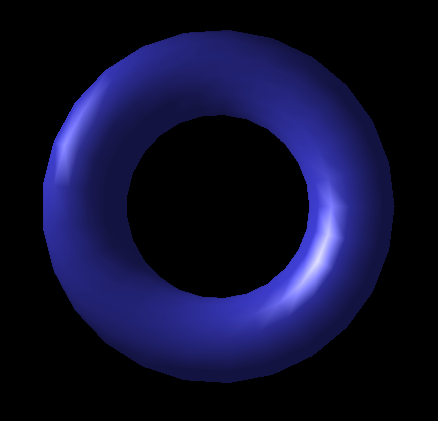
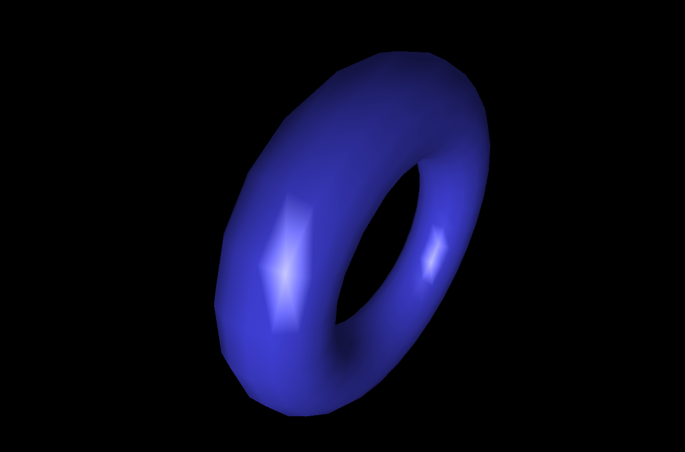
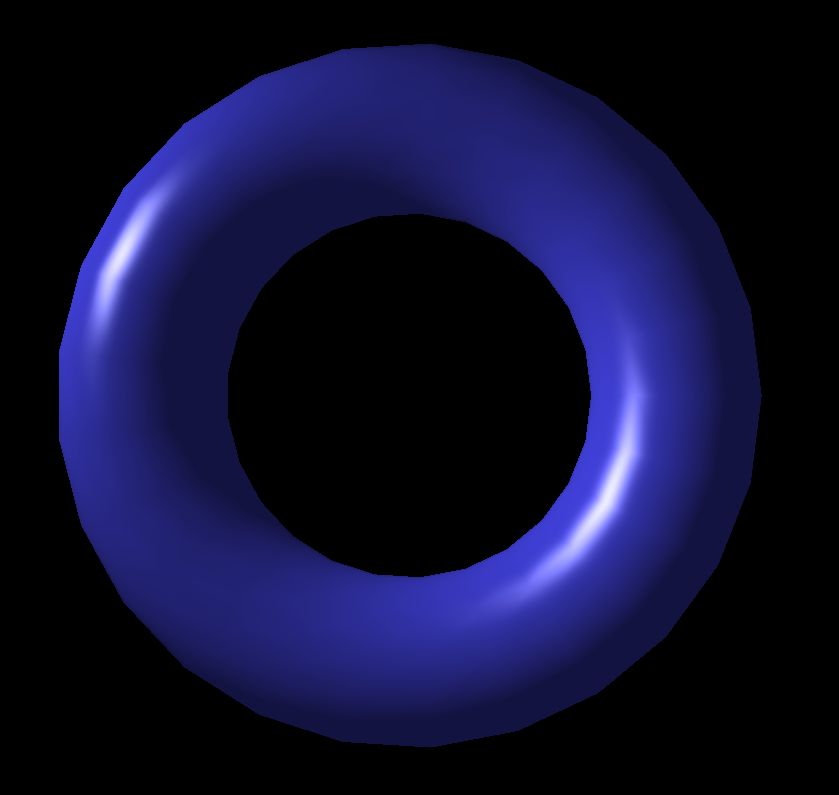
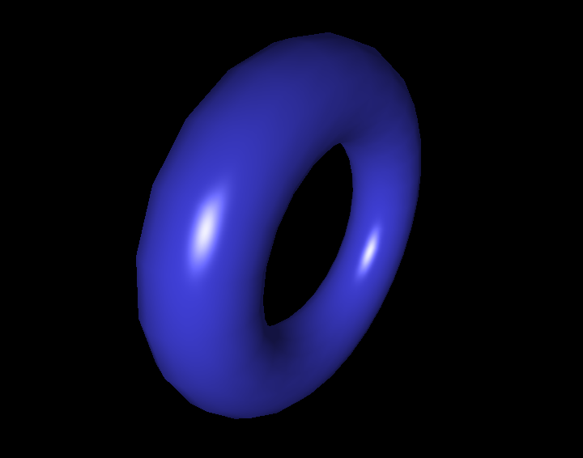

<h1 align = "center"> Atividade Prática 3 - Implementação de Modelos
Locais de Iluminação </h1>

 

<h3 align="center"> João Victor Rodrigues Galvão - 20190172620</h3>
<h3 align="center"> Yvson Nunes Figueiredo - 20190019716</h3>

## Introdução

O Trabalho desenvolvido aqui teve como objetivo implementar dois dos principais modelos de iluminação local estudados na cadeira de Introdução à Computação gráfica: **Gouraud Shading** e  **Phong Shading**.

## Implementação do Gouraud Shading:

Em primeiro plano, com a utilização do template fornecido já com a geometria do objeto e os valores inicias das intensidades luminosas e coeficientes de reflexão, a ideia foi a de realizar os cálculos de iluminação no **vertex shader** e passar o resultado obtido na intensidade **I** de cada vértice da primitiva de maneira interpolada para o **fragment shader**.

No arquivo vertexShader.glsl.js o calculo da intensidade **I** foi feito calculando cada termo do modelo de iluminação de modo separado e depois os somando em **I**.

### Termo ambiente

O cálculo foi direto ocorrendo apenas a multiplicação da intensidade ambiente  e o coeficiente de reflexão ambiente.

~~~ Javascript
 vec4 tA = vec4(Ia,1) * vec4(k_a,1);
~~~

### Termo difuso

O cálculo foi feito a partir do código:

~~~ Javascript
  vec4 tD = (vec4(Ip_diffuse_color,1) * vec4(k_d,1)) * max(0.0,dot(N_cam_spc,L_cam_spc));
~~~

Os termos de intensidade da luz pontual e o coeficiente de reflexão difusa já foram dados. O produto interno foi calculado com o vetor normal do vértice no espaço de câmera e
o vetor de direção da luz pontual (que foi calculado por: **normalize(Ip_pos_cam_spc.xyz - P_cam_spc.xyz)**).

### Termo especular

O cálculo foi realizado da sequinte forma:

~~~ Javascript
  float expoente_n = 16.0; 
  vec4 tE = (vec4(Ip_diffuse_color,1) * vec4(k_s,1)) * pow(max(0.0,dot(R_cam_spc,vision)), expoente_n);
~~~

Como nota, o vetor R foi obtido refletindo o vetor L (normalizado) em relação ao vetor  normal, com a ressalva de que foi necessário passar como argumento para função **reflect()** o L negado. Ademais o vetor **vision** é o vetor normalizado obtido pelo cálculo: **(0,0,0) - P_cam**.

Por fim, assinalamos para a intensidade I a soma tA + tD + tE. No fragment Shader, passamos **I** interpolado para a varável  **gl_FragColor**.

### Imagem gerada pelo Gouraud Shading

 

<b> Figura 1: Torus de frente para mostrar o brilho da imagem gerado pelo Gouraud shading</b>

 

<b> Figura 2: Torus inclinado para mostrar o brilho da imagem gerado pelo Gouraud shading</b>

## Implementação do Phong Shading:

Na abordagem de Phong, os cálculos de iluminação são feitos agora no fragment shading. Em primeira instância, no vertex shader, algumas preparações são feitas. Calculamos variáveis que serão mandadas para o fragment shader: 
- **Ip_pos_cam_fragments** (posição da fonte de luz no espaço da câmera);
- **P_fragments**(vértices no espaço de camera que serão interpolados na passagem para o fragmentShader);

- **Normals_fragments**(vetores normais de cada vérice do objeto no espaço de câmera que serão interpolados).

No fragment shader normalizamos Normals_fragments interpolados de cada fragmento, calculamos **L** analogamente como feito no Gouraud Shading (**normalize(Ip_pos_cam_fragments.xyz - P_fragments.xyz)**), obtemos o **vetor R** por **reflect(-L_cam_spc_fragments, normal_corect)** e o vetor **vision** é a normalização de (**-P_fragments.xyz**).

**O cálculo do termo ambiente se dá de maneira imediata**

~~~ Javascript
 vec4 tA = vec4(Ia,1) * vec4(k_a,1);
~~~

### Termo difuso

O cálculo foi feito a partir do código:

~~~ Javascript
  vec4 tD = (vec4(Ip_diffuse_color,1) * vec4(k_d,1)) * max(0.0,dot(normal_corect,L_cam_spc_fragments));
~~~

### Termo especular

O cálculo análogo ao feito no Gouraud shading

~~~Javascript
    float expoente_n = 16.0;
    vec4 tE = (vec4(Ip_diffuse_color,1) * vec4(k_s,1)) * pow(max(0.0,dot(R_cam_spc_fragments,vision)), expoente_n);
~~~

Finalmente, somamos os termos, assinalamos à intensiade **I** e a atribuitmos a **gl_FragColor**.

## Imagem gerada com Phong Shading

 

<b> Figura 3: Torus de frente para mostrar o brilho da imagem gerado pelo Phong shading</b>

 

<b> Figura 4: Torus inclinado para mostrar o brilho da imagem gerado pelo Phong shading</b>

## Dificuldades na resolução da atividade
Devido ao desconhecimento do padrão de reflexão da função reflect
estavamos obtendo resultados errados com o brilho constando em uma região escura nos dois modelos de iluminação. A dificludade foi sanada com a explicação em aula pelo professor sobre o tipo de reflexão do método.

## Referências

https://www.khronos.org/registry/OpenGL-Refpages/gl4 **(Documentação do GLSL)**
https://threejs.org/docs/#api/en/materials/ShaderMaterial **(ShaderMaterial Three.js)**